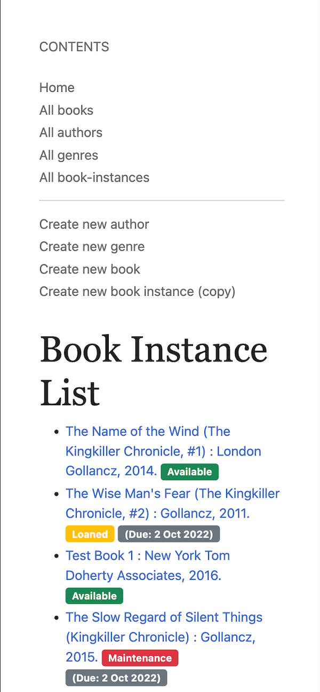

# Local Library Node MVC Project

This is a Node.js Express MVC project for a local library website. It is based on the [MDN Express tutorial](https://developer.mozilla.org/en-US/docs/Learn/Server-side/Express_Nodejs) and the [Express Application Generator](https://expressjs.com/en/starter/generator.html).

_NOTE: MVC is a software design pattern that separates the application into three main logical components: the model, the view, and the controller. The model is the data, the view is the presentation, and the controller is the interface between them._

Learn More about MVC: [https://developer.mozilla.org/en-US/docs/Glossary/MVC](https://developer.mozilla.org/en-US/docs/Glossary/MVC)

## Live Demo

[https://different-undershirt-bull.cyclic.app/](https://different-undershirt-bull.cyclic.app/)

#### Screenshot



## Test the app locally

- Create a `.env` file in the root directory and add the following:

```env
NODE_ENV=development
MONGO_URI=YOUR_MONGO_URI
```

> Note: Set NODE_ENV to 'production' when deploying to production

- Run the app:

```bash
npm i
npm i nodemon -g
npm run devstart
OR
npm i
npm i nodemon -g
npm run serverstart

// Windows
SET DEBUG=express-locallibrary-tutorial:* & npm run devstart
```

- Open [http://localhost:3000](http://localhost:3000) to view it in the browser.

## Usage

Some Available URLs:

- `http://localhost:3000/`
- `http://localhost:3000/catalog`
- `http://localhost:3000/catalog/books`
- `http://localhost:3000/catalog/bookinstances`
- `http://localhost:3000/catalog/authors`
- `http://localhost:3000/catalog/genres`
- `http://localhost:3000/catalog/book/ID`
- `http://localhost:3000/catalog/book/create`
